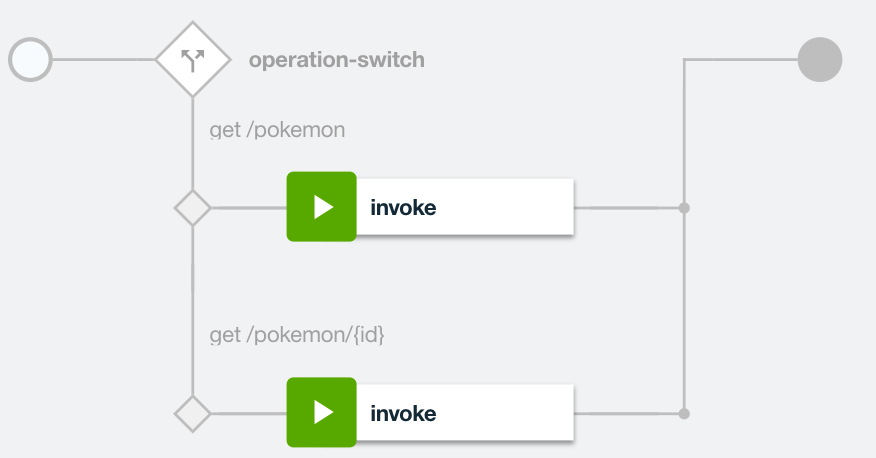

# 2. Build conditional flows for dynamic API execution 

**Authors** 
* [Ozair Sheikh](https://github.com/ozairs)

**Prerequisites**

If you did not complete the previous tutorial from the [series](#01-getting-started-with-api-connect-developer-toolkit), perform the following steps:
1. Download the project from [here](https://github.com/ozairs/apiconnect), either using git command-line command (ie `git clone https://github.com/ozairs/apiconnect`) or the ZIP file from the Web browser and install it on your local system. Make a note of this location.
2. Create a directory for your project in the same location as the cloned project (`<path>/apiconnect`) and open the API designer.
	```
	cd apiconnect
	mkdir apic-workspace
	cd apic-workspace
	apic edit
	```
3. Import the API definitions file from **<path>/apiconnect/conditional/pokemon_1.0.0.yaml**. See instructions [here](https://www.ibm.com/support/knowledgecenter/SSMNED_5.0.0/com.ibm.apic.apionprem.doc/create_api_swagger.html)

In this tutorial, you will learn how to dynamically invoke backend services using conditional logic without writing any code. 

This tutorial is based on the tutorial series available [here](#01-getting-started-with-api-connect-developer-toolkit)

1. In the **Design** tab, under **Paths**, click `/pokemon/{id}`.
2. This API definition contains an `{id}` parameter in the path to parameterize the incoming `id` integer, which can be used as a variable in the API assembly.
4. Click the **Assembly** tab at the top and drag the **Operation Switch** to the action before the Invoke.
5. Select the dropdown beside **Case** and select `get /pokemon`. Click **+ Case** and select `get /pokemon/{id}`. Click the X button to close the action. 

	At this point both operations use the same assembly. The `get /pokemon/{id}` requires a different endpoint to be invoked since it obtains a single pokemon instead of all pokemons.

6. Delete the existing `Invoke` action (click the Invoke and select the trash icon).
7. Drag an Invoke action into the case for `get /pokemon`. When you drag the action into this case, an orange box will appear to indicate the action can be added. Move around the Invoke action until you get the orange box. Enter the URL https://pokemons.mybluemix.net/api/pokemons/. The {id} variable is the same value as the `id` parameter defined in the API designer. Uncheck `Stop on error` since you won't define any error handling logic.
8. Drag another Invoke action into the case for `get /pokemon/{id}`. When you drag the action into this case, an orange box will appear to indicate the action can be added. Move around the Invoke action until you get the orange box. Enter the URL https://pokemons.mybluemix.net/api/pokemons/{id}. The {id} variable is the same value as the `id` parameter defined in the API designer. Uncheck `Stop on error` since you won't define any error handling logic.
	
9. Save your changes and test both operations using the test tool. 
10. Click the **Play icon** to open the built-in test tool. Select the **get /pokemon** operation. Click the **Invoke** button to test our API. The first time you test, you will get a security warning so open the link to accept the self-signed certifcate. Click the **Invoke** button again to see a collection of Pokemon data. Test the **get /pokemon/{id}** operation, enter an **id** value of `1`. A single Pokemon item is returned.
Close the test editor once your happy with the results.

In this tutorial, you learned how to built a simple If-then-else statement based on the incoming API operation.