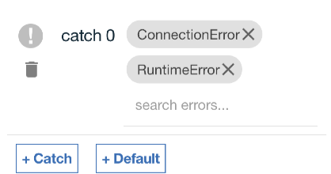
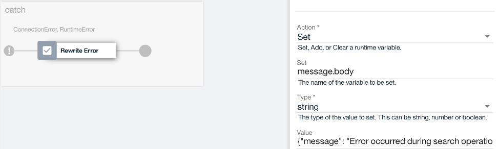

# 4. Handling API Errors

**Authors** 
* [Ozair Sheikh](https://github.com/ozairs)

**Prerequisites**

If you did not complete the previous tutorial from the [series](#01-getting-started-with-api-connect-developer-toolkit), perform the following steps:
1. Download the project from [here](https://github.com/ozairs/apiconnect), either using git command-line command (ie `git clone https://github.com/ozairs/apiconnect`) or the ZIP file from the Web browser and install it on your local system. Make a note of this location.
2. Create a directory for your project in the same location as the cloned project (`<path>/apiconnect`) and open the API designer.
	```
	cd apiconnect
	mkdir apic-workspace
	cd apic-workspace
	apic edit
	```
3. Import the API definitions file from **<path>/apiconnect/error-handler/pokemon_1.0.0.yaml**. See instructions [here](https://www.ibm.com/support/knowledgecenter/SSMNED_5.0.0/com.ibm.apic.apionprem.doc/create_api_swagger.html)

In this tutorial, you will learn how to catch errors within the API assembly. Errors can range from built-in (ie connection failure) or custom (ie InsuffienctFundsException). The API assembly provides a single global error handle to catch errors thrown by any policy.

1. Open the API designer and select the **Assembly** tab.
2. Select the **Show Catches** toggle. A new area is visible below that allows for definition of error handling logic for common error conditions. The default errors are defined [here](http://www.ibm.com/support/knowledgecenter/SSMNED_5.0.0/com.ibm.apic.toolkit.doc/ref_toolkit_catch_errors.html). 

	Multiple approaches are available to throw errors:
	1. The API assembly provides a `throw` policy that triggers the global error handler into the **catch** space, which can contain policies to return an error message to the client.
	2. Alternatively, you can throw errors in your JavaScript code when an error condition is reached. For example, when the Invoke policy returns an non-200 error. You will use this approach to throw and catch errors.
3. Switch back to the existing JavaScript policy. Replace the existing code with the following:
	```
	//get the payload
	var json = apim.getvariable('message');
	console.info("json %s", JSON.stringify(json));

	//code to inject new attribute 
	if (json.body && json.status.code == '200') {
		json.body.platform = 'Powered by IBM API Connect';
		json.headers.platform = 'Powered by IBM API Connect';
	}
	else {
	console.error("throwing apim error %s", JSON.stringify(json.status.code));
		apim.error('ConnectionError', 500, 'Service Error', 'Failed to retrieve data');
	}

	//set the payload
	apim.setvariable('message.body', json.body);
	apim.setvariable('message.headers', json.headers);
	```
	
4. Click the catch area and the **catch+** button and add the following errors:
	* Connection Error
	* RuntimeError
	
5. Each error condition can execute a set of policies. Add a set-variable action to the ConnectionError error. Name it `Rewrite Error` and enter the following:
	* Action: set
	* Set: message.body
	* Type: string
	* Value: {"message": "Unable to find Pokemon."}
	
6. Save the assembly.
7. Testing this policy requires an actual error to occur. Click the **Play icon** to open the built-in test tool. Test the **get /pokemon/{id}** operation, enter an **id** value of `0`. You should see the error message `'{"message": "Unable to find Pokemon."}'`.

In this tutorial, you learned how to catch errors during execution of the API assembly and return an error message back to the API consumer.