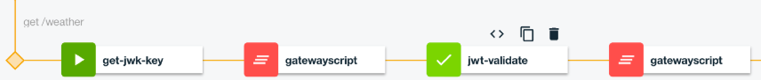

# 5. Protect access to API services with Auth0 & JWT

**Authors** 
* [Shiu-Fun Poon](https://github.com/shiup)
* [Ozair Sheikh](https://github.com/ozairs)

**Prerequisites:** 

If you did not complete the previous tutorial from the [series](#01-getting-started-with-api-connect-developer-toolkit), perform the following steps:
1. Download the project from [here](https://github.com/ozairs/apiconnect), either using git command-line command (ie `git clone https://github.com/ozairs/apiconnect`) or the ZIP file from the Web browser and install it on your local system. Make a note of this location.
2. Create a directory for your project in the same location as the cloned project (`<path>/apiconnect`) and open the API designer.
	```
	cd apiconnect
	mkdir apic-workspace
	cd apic-workspace
	apic edit
	```
3. Import the API definitions file from **<path>/apiconnect/jwt/pokemon_1.0.0.yaml**. See instructions [here](https://www.ibm.com/support/knowledgecenter/SSMNED_5.0.0/com.ibm.apic.apionprem.doc/create_api_swagger.html)

In this tutorial, you will control access to the backend service by requiring a valid JWT (JSON Web Token). For more information about JWT, see [here](https://jwt.io). JWT is a JSON-based token that provides a series of claims that are cryptographically verifyable. The base claim is a subject-audience pair which asserts the token for a particular user.

In our scenario, the API definition requires a valid JWT token generated from a trusted identity provider - [auth0.com](https://auth0.com). 

The following instructions provide guidance on how to setup an auth0 account to issue JWT tokens. Its not a comprehensive step-by-step guide, so we would recommend you check out their [docs](https://auth0.com/docs).

**Auth0 Setup**

1. Login to [auth0](https://www.auth0.com) and create an auth0 account.
2. Click the **APIs** link from the nav bar and create a new API, called `Pokemon` and identifier with `<yourid>.apiconnect.com`.
3. In the **Quick Start** section make a note of the jwsURI:
	```
	secret: jwks.expressJwtSecret({
			.
			.
			jwksUri: "https://ozairs.auth0.com/.well-known/jwks.json"
		}),
	```
4. In the **Scopes** section create new scopes called `read` and `write` and add a description.
5. In the **Non Interactive Clients** section, expand the `Pokemon Client` and select the previously created scopes and click **Update**.
6. In the **Test** section, copy and paste the curl command in a command prompt (if curl is unavailable, use other alternatives).
	```
	$ curl --request POST \
	>   --url https://ozairs.auth0.com/oauth/token \
	>   --header 'content-type: application/json' \
	>   --data '{"client_id":"<client_id>","client_secret":"<client_secret>","audience":"https://ozairs.apiconnect.com/","grant_type":"client_credentials"}'
	{"access_token":"<token>","expires_in":86400,"scope":"write read","token_type":"Bearer"}
	```
	In the real-world use case, a web / mobile application will issue this request to obtain an access token.

Lets switch back to API Connect and add a JWT policy.

**API Connect Setup**

1. Open the Pokemon API in the API designer and click the **Assemble** tab.
2. Click the `operation-switch` policy and add a new case for the `POST /pokemon` with the following policies:
	1. Add a `Invoke` action, named `get-jwk-key` with the following:
    	* URL: https://ozairs.auth0.com/.well-known/jwks.json
		* Cache Type: Time to Live
		* Cache Time to Live: 900
		* Response object variable: rsa256-key

  	2. Add a GatewayScript policy to extract the JSON Web Key (JWK) from the previous `Invoke` policy into a context variable
	```
	var rsa256Key = apim.getvariable('rsa256-key');
	apim.setvariable('jwk-key', JSON.stringify(rsa256Key.body.keys[0]));
	```

  	3. Add a `Validate JWT` policy with the following:
		* JWT: request.headers.authorization
		* Output Claims: decoded.claims
		* Issuer Claim: .*\.auth0\.com\/
		* Audience Claim: .*\.apiconnect\.com\/
		* Verify Crypto JWK variable name: jwk-key
		
		**Note**: You can create a stronger regular expression in the issuer and audience claims field for enhanced security. 

	4. Add a GatewayScript policy to return the decoded claims
	```
	apim.setvariable('message.body', apim.getvariable('decoded.claims'));
	```
	

	Notice that the `post /pokemon` does not have a backend Invoke policy. Generally speaking, operations with the POST method insert new data into the database. The current backend does not support this operation, so we will simply return the decoded claims to verify the JWT token was successfully validated.
	
3. Test the policy.
	A real-world application will have two endpoints:
	1. **Auth0**: obtain the JWT token against the Auth0 authorization server directly (ie no API Connect involvement).
	```
	curl --request POST \
	>   --url https://ozairs.auth0.com/oauth/token \
	>   --header 'content-type: application/json' \
	>   --data '{"client_id":"<client_id>","client_secret":"<client_secret>","audience":"https://ozairs.apiconnect.com/","grant_type":"client_credentials"}'
	```
	2. **API Connect**: validate the JWT digital signature using a JWK (obtained remotely)
		1. Click the Play button and copy / paste the `access_token` value into the Authorization header.
		2. The response will contain the decoded JWT
		```
		{
		 "iss": "https://ozairs.auth0.com/",
		 "sub": "gHXm6ss79Jm866TYdyMCtPyyZ25iFpWq@clients",
		 "aud": "https://ozairs.apiconnect.com/",
		 "exp": 1494354567,
		 "iat": 1494268167,
		 "scope": "write read"
		}
		```

For more information about JWT, you can read the link [here](https://developer.ibm.com/apiconnect/2016/08/16/securing-apis-using-json-web-tokens-jwt-in-api-connect-video-tutorial/)

Summary of the JWT security actions:
 - `jwt-validate`: validate the identity assertion claims from a jwt token
 - `jwt-generate`: generate jwt token with identity assertion claims

In this tutorial, you used a JWT validate policy to verify the JSON Web signature of a JWT token that was generated from auth0 (external identity provider).