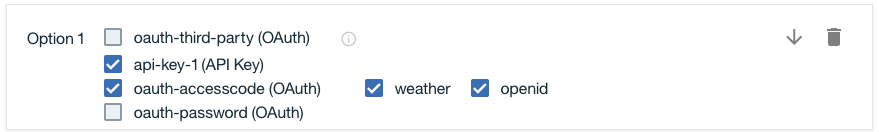
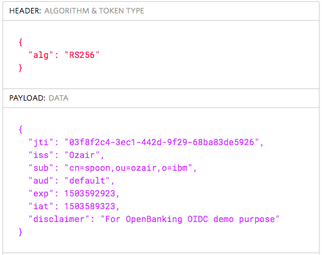
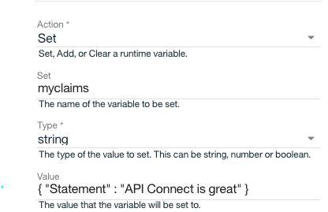
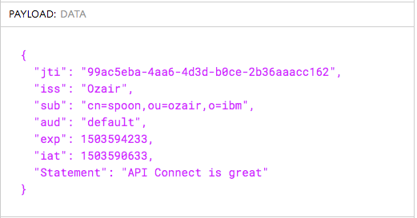
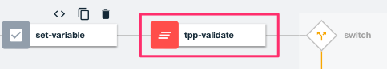

## Protect access to Open Banking APIs using OpenID Connect

In this tutorial, you will protect access to your APIs using [OpenID Connect](http://openid.net/connect/) to support Open Banking / PSD2 requirements.

**What is OpenID Connect?**

OpenID Connect (OIDC) is built on top of the OAuth 2.0 protocol and focuses on identity assertion and exchanging of verifiable claims. OIDC provides a flexible framework for identity providers to validate and assert user identities for Single Sign-On (SSO) to web, mobile, and API workloads. This capability helps address authentication and authorization requirements for Payment Services Directive 2 (PSD2) and Open Banking. Furthermore, JWT tokens within an OIDC flow allow flexible exchange of payment and account information in a verifiable manner.

**What is OpenBanking / PSD2?**

European Union’s Payment Services Directive [PSD2] is a prescription for more provider competition and consumer options when performing banking activities. The UK government has similarly established Open Banking regulations that cover the same PSD2 requirements with UK-specific regulations. It will allow industry regulators and technology consortiums to drive API adoption across the industry. 

The OpenBanking working group has published the API specifications for banks to expose their account and payments APIs to third-party providers. These specifications will also address the European Union’s Payment Services Directive (PSD2) requirements. This initiative is a big deal across Europe and even banks outside of Europe are paying close attention on the potential industry disruption as it enables banks, fintech or any third-party company to build payment-based solutions.

**API Connect deliver support for OpenBanking / PSD2?**

Financial service providers cannot do this alone. They need to engage with the right technology partners to deliver the best digital platform. IBM is well positioned to help meet your API, OpenBanking and PSD2 requirements. More over, IBM API Connect delivers a comprehensive API platform to secure and manage business assets and is the API platform trusted by many of the largest financial service providers in the world. It delivers key capabilities for securing and managing business assets:
* **API Security**: Highly secure and robust API security capabilities to protect access to critical payment and account assets
* **Developer onboarding**: self-service developer portal to onboard developers/third-party providers (TPP) and register for banking APIs
* **Analytics**: gain insight into TPP usage of banking APIs across any API version
* **API Management**: manage access to different versions of API, including the ability to lifecycle manage (deprecate, retire, new versions, etc)

**Authors** 
* [Shiu-Fun Poon](https://github.com/shiup)
* [Ozair Sheikh](https://github.com/ozairs)

**Duration**: 20 minutes

**Skill level**: Intermediate

**Prerequisites:** 

* [API Connect Developer Toolkit 5.0.7.1+](https://www.ibm.com/support/knowledgecenter/SSMNED_5.0.0/com.ibm.apic.toolkit.doc/tapim_cli_install.html)
* For testing, you will need [Postman](https://www.getpostman.com/).
* Download the Postman collection [here](https://www.getpostman.com/collections/9ab248322bd2f0a75eea)

Open Banking / PSD2 has prescribed the use of OpenID Connect to protect banking APIs. Specifically, it requires the use of the [OpenID Connect hybrid flow](http://openid.net/specs/openid-connect-core-1_0.html#HybridFlowSteps). The foundation of OpenID Connect is OAuth so it uses the same grant types such as code, password, client credentials and token. The hybrid flow adds a twist to the regular OAuth/OpenID Connect flow with the introduction of multiple response types. For example the `response_type` field can contain multiple values separated by spaces (ie `response_type=id_token code`). In addition, OpenID Connect flow will use a special scope `openid` to notify the OAuth/OpenID Connect provider that the response should contain both an `id_token` and `access token`. The access token encapsulates the permissions between the OAuth client, resource owner & OAuth server - its the token used to gain access to the underlying API. The `id_token` is a JWT token that contains the identity information. It includes a set of claims (standard and private) that describe the subject, target and the operations performed. Since the JWT token contains assertions and (possibly) sensitive information, it should be signed (at a minimum) and optionally encrypted.

The OpenID Connect hybrid flow specification supports multiple permutations of the `response_type` field. The OpenBanking group has mandated the use of the `response_type=id_token code` as the flow for protecting API resources. This flow will issue the `id_token` when the authorization code is generated. The final response (ie exchanging the code for an access token) may optionally contain the same `id_token` and access token.

In this tutorial, you will learn how to setup API Connect with the hybrid code flow to protect access to backend API resources. Furthermore, we will talk about the area's in the API assembly that will need to be customized to support each banks requirement. It will be unique for each bank, so we simply provide high-level guidance.

**Instructions:** 

These instructions assume you are familiar with the basic steps of the API designer. You will import the OAuth provider YAML file which provides support for OIDC connect. We will review it first to understand the core functions.

1. Import API definitions file: oauth, utility and Weather. Click the **Add (+)** button and select **Import API from a file or URL**. 
	* [https://raw.githubusercontent.com/ozairs/apiconnect/master/openbanking/weather-provider-api_1.0.0.yaml]() 
	* [https://raw.githubusercontent.com/ozairs/apiconnect/master/openbanking/oidc_1.0.0.yaml](). 
	* [https://raw.githubusercontent.com/ozairs/apiconnect/master/openbanking/utility_1.0.0.yaml]().

	In this tutorial, we will simulate the authentication service (leveraging HTTP Basic AUth) using the `utility` API, which is API Connect hosted Assembly that will parse the input and return back the appropriate response. You could also use other approaches to validate the resource owner (such as `redirect`), but for simplicity, we will use a simple service to demonstrate the input and output parameters of the authentication service call.

2. Navigate to the folder `https://github.com/ozairs/apiconnect/blob/master/utility/basic-auth` directory and open the `basic-auth.js` file. This file will simulate the authentication service. A few points about the code:
	* Authentication is simulated by validating the username/password passed in via HTTP Basic Auth header against the query params. For example, the input request will contain a HTTP Basic Auth header with value `spoon:spoon` (base 64 encoded) and will compare that against the Authentication URL call in the OIDC provider (ie `https://127.0.0.1:9443/utility/spoon/spoon`).
	* If you need access to the original query parameters passed into the request during authentication, you can access the `message` context to parse them. An example is shown that is needed for OpenBanking is the `request` query parameter which is a JWT token containing information about the transaction. This token can be passed to the service performing the authentication
	```
	var requrl = querystring.parse(apim.getvariable('message.headers.x-uri-in').split('?')[1]);
	console.error('parsed query param: request (jwt) %s', requrl['request']);
	```
	* Optionally, after authentication is done, you can pass various response headers if you want to do any of the following:
	 * Modify scope values
	 * Inject metadata into the access token
	 * Inject metadata into the payload 
3. Open the API designer and select the `utility` API. This API will simulate the authentication service. 
4. Click the **Assemble** tab and select the `switch` statement with the condition `/basic-auth/{username}/{password}` and its corresponding GatewayScript. You can modify the code from `basic-auth.js` and copy it here or leave it as-is.
5. Click the **OAuth 2 OIDC Provider 1.0.0** API. Scroll down to Authentication section and make a note of the **Authentication URL**: `https://$(api.endpoint.address):9443/utility/basic-auth/spoon/spoon`. In previous example, we used `https://127.0.0.1:9443/utility/basic-auth/spoon/spoon` which will also work. Replace `spoon/spoon` with another value if you want to use a different set of username and password. 
6. Scroll down to the Properties section. You will notice three properties:
 * OIDCIssuer: string to represent the issuer of the token (default value is IBM APIc)
 * JWSSignPrivateKey: string to represent the private key used to sign the JWT token (id_token)
 * JWSAlgorithm: algorithm used during the signing process
 Change the value of the OIDCIssuer to validate the value populated in the id_token `iss` field.
7. Click the **Assemble** tab at the top. You will notice several policies that control the generation of the JWT token for OIDC flows. The `set-variable` uses the variables defined in the **Properties** section. You can customize other steps in the flow based on Open Banking requirements, but let's leave it as-is for now.
8. When using the API Connect developer toolkit with OAuth Access code flow, you will need to redirect the application to an OAuth client to exchange the authorization code for an access code. This is typically done in an OAuth application, but we can use a couple of techniques to streamline testing.
9. Configure environment for OAuth Access Code 
	* Open a command prompt and make sure your in the project directory (ie same directory as the project yaml files). Enter the command `apic config:set oauth-redirect-uri=https://www.getpostman.com/oauth2/callback`. 
	* Open Postman Preferences and disable **Automatically follow redirects**. This allow us to capture the code and id_token sent back from API Connect.
	
9. Protect Weather API with OpenID Connect Access Code flow  
	* Open the **Weather Provider API** and scroll down to **Security Definitions**. Click the + button and select **OAuth**.
	* Enter the name `openid-accesscode` and select the **Access Code** flow. Enter the **Authorize URL** value `https://127.0.0.1:9443/oauth2/authorize` and **Token URL** value `https://127.0.0.1:9443/oauth2/token`.
	* Scroll down to the scopes section and enter the scopes `weather` and `openid`.
	* In the **Security** section, click the + button to create a new option and select **openid-accesscode (OAuth)** and the two scopes. Move the security definition at the top.
	* Save the API definition.	
	**Note:** Multiple security definitions allow you provide multiple options to satisfy consumer security requirements.
	
	

10. Open the request called `OIDC Access Code (OpenBanking)`. Adjust the values if your endpoint is different than `https://127.0.0.1:4001`.
	* Submit the request and make sure you get the following response:
	```
	<?xml version="1.0" encoding="UTF-8"?>
	<html>
		<body>Go ahead</body>
	</html>
	```
	The Access Code flow requires an additional step to obtain an access token. You will need to exchange the code for an access token. This is typically done by an OAuth application but you will simulate one for simplicity.
	* Click the **Headers** tab and copy the value after `code=` and before `state=`. (Use a textpad to help here). Notice that the response contains both the authorization code and id_token.
	* Copy the `code` so it remains on your clipboard. 
	* Open the `OAuth AC to Token` request and click the **Body** tab. Paste the code value into the `code` field. Click **Send** and verify you receive an access token
11. Open the Weather request and select the **Headers** tab. Click **Send** and validate that the request is successful.
	```
	{
		"zip": "90210",
		"temperature": 64,
		"humidity": 84,
		"city": "Beverly Hills",
		"state": "California",
		"platform": "Powered by IBM API Connect"
	}
	```
	All the test cases till now have focused on accessing the API using an OAuth access token although an JWT token (via `id_token` field) is also returned. The JWT token allows the OAuth application access to information about the user identity.

12. Open the Web site [jwt.io](https://jwt.io). Copy/paste the id_token value into the **Encoded** textbox, which should then display the decoded token

	

The fields within the JWT token can be customized based on your environment. The OAuth provider Assembly provides the flexibility to generate a JWT token and optionally sign and encrypt it. Let's review how the fields are generated:
 * jti: automatically generated unique id
 * iss: OIDCIssuer property value in the OAuth provider YAML 
 * sub: authenticated credential from the **basic-auth.js** file
 * aud: application clientId (ie `default`)
 * exp/iat: validity periods for the token
 * disclaim: custom claim

 The last three fields (exp/iat/disclaim) are hardcoded within the jwt-generate action. Let's review the jwt-generate policy to understand how these fields can be customized.

13. Switch back to the API designer and select the **Assemble** tab. Scroll to the right and select `jwt-generate`. You will see the validity period is 3600 seconds. You can modify these value based on your environment. You should also see another variable called `added.claim` under the **Private claims** field. You can also create your own custom claims and include them in the jwt-generate action. 
14. Select the `set-variable` policy and create new action called `myclaims` with the value `{ "Statement" : "API Connect is great" }`
	
	

15. Run the tests again and view the JWT token again using [jwt.io](https://jwt.io). You should see the custom claim in the token.

	

16. The OpenBanking specification requires validation of the TPP for each OAuth call (/token & /authorize). It requires that the distinguished name (DN) from the X509 certificate (via mutual TLS) match the client_id (or a previously agreed combination). There is no mandate that the OAuth call has to be directly done via mutual TLS, you can use an external load balancer to pass in the DN as an HTTP header that can be used as part of the validation logic. You can add a `gatewayscript` policy between the `set-variable` and the `switch` policy with custom logic to validate the TPP.

	

In this tutorial, you learned how to protect an API using OpenID Connect hybrid flow and support PSD2/Open Banking requirements. You learned how to customize the OIDC provider YAML file to support each providers requirements.

**Next Tutorial**: [Enforcing Rate Limits for APIs](../master/rate-limit/README.md)