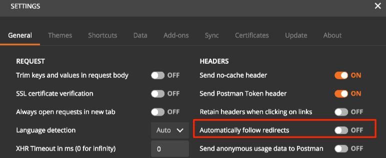
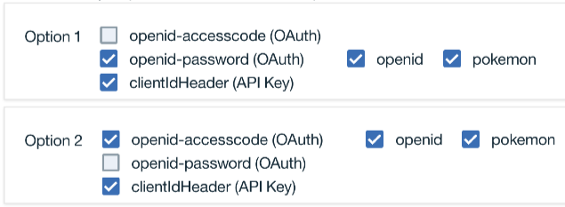
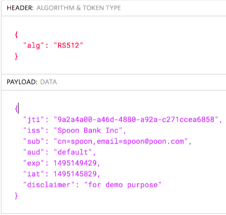

# 6. Protect access to APIs using OpenID Connect

**Authors** 
* [Shiu-Fun Poon](https://github.com/shiup)
* [Ozair Sheikh](https://github.com/ozairs)

**Prerequisites:** 

If you did not complete the previous tutorial from the [series](#01-getting-started-with-api-connect-developer-toolkit), perform the following steps:
1. Download the project from [here](https://github.com/ozairs/apiconnect), either using git command-line command (ie `git clone https://github.com/ozairs/apiconnect`) or the ZIP file from the Web browser and install it on your local system. Make a note of this location.
2. Create a directory for your project in the same location as the cloned project (`<path>/apiconnect`) and open the API designer.
	```
	cd apiconnect
	mkdir apic-workspace
	cd apic-workspace
	apic edit
	```
3. Import the API definitions file from **<path>/apiconnect/openid/pokemon_1.0.0.yaml**. See instructions [here](https://www.ibm.com/support/knowledgecenter/SSMNED_5.0.0/com.ibm.apic.apionprem.doc/create_api_swagger.html)

For testing, you will to download [Postman](https://www.getpostman.com/).

In this tutorial, you will protect access to your APIs using OpenID Connect, which is built on top of OAuth and focuses on identity validation. It uses the same OAuth grant types (implicit, password, application and access code) but uses OpenID Connect specific scopes, such as `openid` with optional scopes to obtain the identity, such as `email` and `profile`.

For more information about OAuth, see [here](https://www.ibm.com/support/knowledgecenter/SSMNED_5.0.0/com.ibm.apic.toolkit.doc/tutorial_apionprem_security_OAuth.html)

1. Import API definitions file
	1. Click the **Add (+)** button and select **Import API from a file or URL**.
    2. Click **Select File** and navigate to **utility_1.0.0.yaml**. Click **Import** to finish the task.
	3. Click **Select File** and navigate to **oauth_1.0.0.yaml**. Click **Import** to finish the task.
    4. Click the **OAuth 2 OIDC Provider 1.0.0** API. Take a note of a few items:
    	* **Paths**: Token API exposed on paths `/oauth2/authorize` and `/oauth2/token`. The paths `/oauth2/introspect` and `/oauth2/issued` allow you to obtain information about the access token.
		* **OAuth 2**: The default grant types supported, but more important are the scopes available. The scope `openid` triggers the OpenID Connect flow and the scope `pokemon` is the consumer resource. Add additional scopes for your applications here.
		* **Authentication URL**: the resource owner is authenticated using the endpoint `https://127.0.0.1/utility/basic-auth/spoon/spoon`. This is a mock service in the **utility_1.0.0.yaml** that returns the authenticated credential in JSON format. Replace `spoon` with another value if you want to use a different name.
		* Click the **Assemble** tab at the top. You will notice several policies that control the generation of the JWT token for OIDC flows. The `set-variable` and `jwt-generate` can be customized if you need to provide custom claims and other JWT information.
		

2. Test the unprotected `/pokemon` and `/pokemon/{id}` APIs
	Using either the built-in test tool (switch back to the Pokemon API) or curl, make sure you can access the APIs.
	```
	$ curl https://127.0.0.1:4001/api/pokemon -H "x-ibm-client-id: default" -k
	[{"data":{"moves":"fast"},"height":"34","name":"charmeleon","weight":432,"id":"2"},{"data":{"moves":"very fast"},"height":"90","name":"venusaur","weight":80,"id":"3"},{"data":{"moves":"slow"},"height":"70","name":"ivysaur","weight":200,"id":"1"},{"data":{"moves":"fast"},"height":"50","name":"bulbasuar","weight":100,"id":"4"},{"data":{"moves":"slow"},"height":"70","name":"charmander","weight":122,"id":"5"},{"data":{"moves":"slow"},"height":"70","name":"charmander","weight":122,"id":"9ed78062996515b4db7e1b78d73208b0"}]

	$ curl https://127.0.0.1:4001/api/pokemon/1 -H "x-ibm-client-id: default" -k
	{"data":{"moves":"slow"},"height":"70","name":"ivysaur","weight":200,"id":"1","platform":"Powered by IBM API Connect"}
	```
3. Protect Pokemon API with OpenID Connect
   
	Modify the security definition of the Pokemon API (ie consumer API) to protect access using the OAuth 2 OIDC Provider. It will require consumer applications to obtain an access token before invoking the Pokemon API.
	1. Open the **pokemon 1.0.0** API and scroll down to **Security Definitions**. Click the + button and select **OAuth**.
	2. Enter the name `openid-password` and select the **Password** flow. Enter the **Token URL** value `https://127.0.0.1/oauth2/token` (replace the hostname if your using a different value).
	3. Scroll down to the scopes section and enter the scopes `pokemon` and `openid`.
	4. In the **Security** section, select **openid-password (OAuth)** and the two scopes.
	4. Save the API definition.

4. Test the `/pokemon` and `/pokemon/{id}` APIs, you will now get an error because the API is protected using OAuth. In the next step you will obtain an access token to call the same APIs
	```
	curl https://127.0.0.1:4001/api/pokemon/1 -H "x-ibm-client-id: default" -k
	{ "httpCode":"401", "httpMessage":"Unauthorized", "moreInformation":"This server could not verify that you are authorized to access the URL" }
	```
5. Obtain an access token from the OIDC provider (using the resource owner grant type). Invoking OAuth APIs can be tricky because you need to have the appropriate parameters, so we have provided a Postman collection to simplify the testing.
	1. Open Postman and select **File -> Import -> Import from Link** and enter the value https://www.getpostman.com/collections/951c78382a60b7f7be67 or you can optionally import from the file `OAuth.postman_collection.json` in your local directory.
	2. Open the request called `OIDC Password`. Select the **Body** link and notice that a default client id of `default` and client secret of `SECRET` is pre-configured. Adjust the values if your endpoint is different than `https://127.0.0.1:4001`.
	3. Submit the request and validate that you get back an access token and JWT token.
	```
	{
		"token_type": "bearer",
		"access_token": "<sanitized>",
		"expires_in": 3600,
		"scope": "pokemon openid",
		"refresh_token": "<sanitized>",
		"id_token": "<sanitized>"
	}
	```
	4. Copy the access token so it remains on your clipboard. You are now ready to call the Pokemon API!
6. Open the Pokemon request and select the **Headers** tab. Enter the previously copied access token into the Authorization header field and click **Send** to validate that the request is successful.
	```
	{
		"data": {
			"moves": "slow"
		},
		"height": "70",
		"name": "ivysaur",
		"weight": 200,
		"id": "1",
		"platform": "Powered by IBM API Connect"
		}
	```

You successfully obtained an OIDC token using the resource owner grant type, which should only be used for secure OAuth applications since the username and password are shared between the resource owner and OAuth application. Most often you will use the Access Code flow (ie authorization code grant) since it protects the username and password from the OAuth application and still enables sharing of resources to the OAuth application. In the next step, you will setup an Access Code flow. 

When using the API Connect developer toolkit with OAuth that uses the Access code flow, you will need to redirect the application to an OAuth client to exchange the authorization code for an access code. This is typically done in an OAuth application, but we can use a couple of techniques to streamline the test case.

1. Configure environment for OAuth Access Code 
	1. Open a command prompt and make sure your in the project directory (ie same directory as the project yaml files). Enter the command `apic config:set oauth-redirect-uri=https://localhost/oauth-redirect-uri`. 
	2. Verify that the `oauth-redirect-uri` is set within the file `.apiconnect/config`.
	`oauth-redirect-uri: 'https://www.getpostman.com/oauth2/callback'`
	3. Open Postman Preferences and disable **Automatically follow redirects**.
	

2. Protect Pokemon API with OpenID Connect Access Code flow  
	1. Open the **pokemeon 1.0.0** API and scroll down to **Security Defenitions**. Click the + button and select **OAuth**.
	2. Enter the name `openid-accesscode` and select the **Access Code** flow. Enter the **Authorize URL** value `https://127.0.0.1/oauth2/authorize` and **Token URL** value `https://127.0.0.1/oauth2/token`. (change the hostname to reflect your environment) The port 443 is used instead of 4001 since the call is done to a service hosted on the DataPower Gateway. You could have used the Docker mapped port too.
	3. Scroll down to the scopes section and enter the scopes `pokemon` and `openid`.
	4. In the **Security** section, click the + button to create a new option and selet **clientIdHeader (API Key)**, **openid-accesscode (OAuth)** and the two scopes.
	4. Save the API definition.	
	**Note:** Multiple security definitions allow you provide multiple options to satisfy consumer security requirements.
	

3. Open the request called `OIDC Access Code`. Adjust the values if your endpoint is different than `https://127.0.0.1:4001`.
	1. Submit the request and make sure you get the following response:
	```
	<?xml version="1.0" encoding="UTF-8"?>
	<html>
		<body>Go ahead</body>
	</html>
	```
	The Access Code flow requires an additional step to obtain an access token
	2. Click the Headers tab and copy the value after `code=`
	3. Copy the `code` so it remains on your clipboard. You will need to exchange the code for an access token
	4. Open the `OAuth AC to Token` request and click the **Body** tab. Paste the code value into the `code` field. Click **Send** and verify you receive an access token
4. Open the Pokemon request and select the **Headers** tab. Enter the previously copied access token into the Authorization header  after the `Bearer` string and click **Send**. Validate that the request is successful.
	```
	{
		"data": {
			"moves": "slow"
		},
		"height": "70",
		"name": "ivysaur",
		"weight": 200,
		"id": "1",
		"platform": "Powered by IBM API Connect"
	}
	```
	All the test cases till now have focused on accessing the API using an OAuth access token although an JWT token (via `id_token` field) is also returned. The JWT token allows the OAuth application access to information about the user identity.

5. Open the Web site [jwt.io](https://jwt.io). Copy/paste the id_token value into the **Encoded** textbox, which should then display the decoded token
	


In this tutorial, you learned how to protect an API using OpenID Connect resource owner and access code flow.